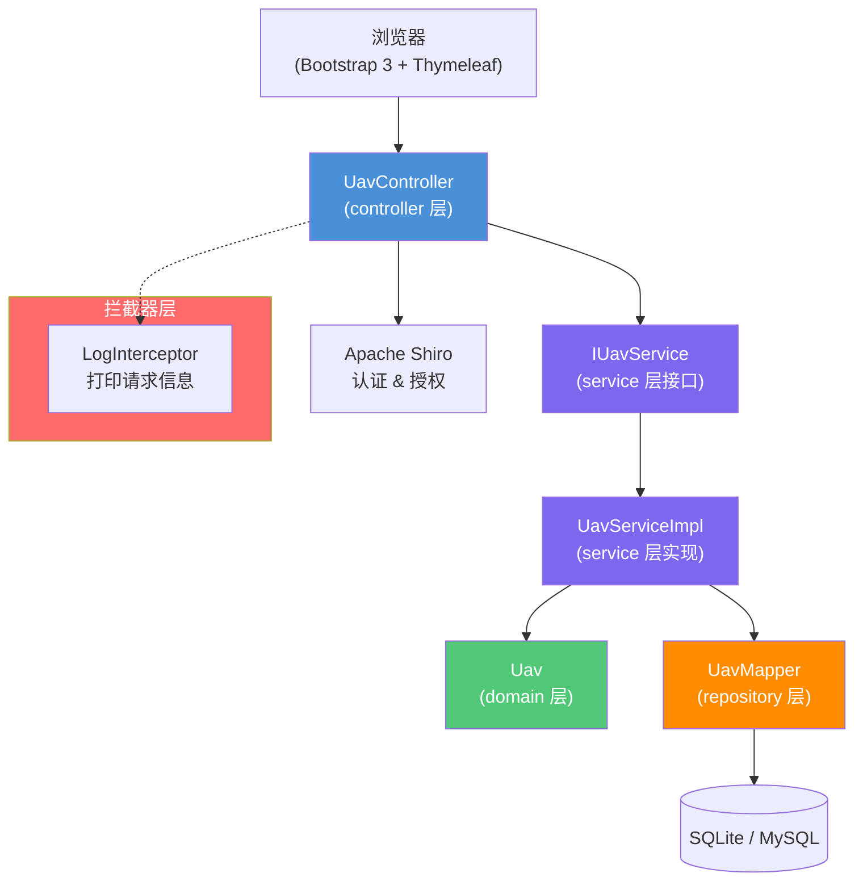

# 无人机信息管理系统 技术设计文档

**关联需求**：[uav-management-spec.md](../01-product-specs/uav-management-spec.md)  
**文档状态**：已确认  
**创建时间**：2026-06-13  
**最后更新**：2026-06-13  
**负责人**：@developer

---

## 概述

基于 Spring Boot 2.2.x + MyBatis + Thymeleaf 实现无人机信息管理系统，采用标准四层架构（controller/service/domain/repository），通过 Apache Shiro 进行身份认证。系统支持 SQLite（开发/初期）和 MySQL（生产）双数据库切换，无人机属性支持 AI 自动生成填充。服务层和数据操作层接口与实现分离在不同包中。

---

## 架构设计

### 组件关系图



### 包结构

```
com.example.uav
├── controller/          # 控制层
│   └── UavController.java
├── service/             # 服务层接口
│   └── IUavService.java
├── service/impl/        # 服务层实现
│   └── UavServiceImpl.java
├── domain/              # 领域模型
│   └── Uav.java
├── repository/          # 数据访问层接口（MyBatis Mapper）
│   └── UavMapper.java
├── config/              # 配置类
│   ├── ShiroConfig.java
│   └── DruidConfig.java
├── common/              # 通用工具
│   ├── AjaxResult.java       # 统一响应结果
│   └── BaseEntity.java       # 基础实体（id, 时间等）
├── exception/           # 异常处理
│   └── GlobalExceptionHandler.java
└── interceptor/         # 拦截器
    └── LogInterceptor.java
```

### 数据流向

**请求处理流程**：

1. 浏览器发送 HTTP 请求，经 LogInterceptor 打印请求信息
2. UavController 接收请求参数，调用参数校验（`@Valid`）
3. Controller 调用 `IUavService` 接口方法
4. `UavServiceImpl` 执行业务逻辑，调用 `UavMapper` 进行数据操作
5. `UavMapper`（MyBatis）与数据库交互，返回实体对象
6. Service 将结果返回给 Controller
7. Controller 返回 Thymeleaf 视图或 JSON 响应

**异常处理流程**：

1. Service 层抛出业务异常
2. `GlobalExceptionHandler` 捕获异常并返回错误信息

---

## 接口定义

### Thymeleaf 页面路由

| 方法 | 路径 | 描述 | 视图 |
|------|------|------|------|
| GET | `/uav/list` | 无人机列表页面 | `uav/list.html` |
| GET | `/uav/add` | 新增无人机页面 | `uav/add.html` |
| GET | `/uav/edit/{id}` | 编辑无人机页面 | `uav/edit.html` |

### REST API（AJAX 接口）

| 方法 | 路径 | 描述 | 请求体 | 响应体 |
|------|------|------|--------|--------|
| GET | `/uav/list` | 分页查询无人机列表 | 查询参数 | `AjaxResult<Page<Uav>>` |
| GET | `/uav/{id}` | 查询无人机详情 | — | `AjaxResult<Uav>` |
| POST | `/uav/add` | 新增无人机（支持 AI 生成属性） | `Uav` 表单 | `AjaxResult` |
| PUT | `/uav/edit` | 修改无人机信息 | `Uav` 表单 | `AjaxResult` |
| DELETE | `/uav/remove/{id}` | 删除无人机（逻辑删除） | — | `AjaxResult` |
| GET | `/uav/aiGenerate` | AI 自动生成无人机属性 | — | `AjaxResult<Uav>` |

#### 接口详情：GET /uav/list（分页查询）

**请求参数**：

| 参数名 | 位置 | 类型 | 必填 | 说明 |
|--------|------|------|------|------|
| pageNum | query | Integer | 否 | 页码，默认 1 |
| pageSize | query | Integer | 否 | 每页条数，默认 10 |
| name | query | String | 否 | 无人机名称（模糊查询） |
| status | query | String | 否 | 状态筛选 |

**响应示例**：

```json
{
  "code": 0,
  "msg": "success",
  "data": {
    "total": 100,
    "rows": [
      {
        "id": 1,
        "name": "DJI Mavic 3",
        "type": "多旋翼",
        "serialNumber": "SN202406001",
        "maxFlightTime": 46,
        "maxRange": 30.0,
        "maxAltitude": 6000,
        "payloadCapacity": 0.5,
        "batteryCapacity": 5000,
        "weight": 895,
        "status": "active",
        "description": "专业航拍无人机...",
        "createdAt": "2026-06-13 10:00:00",
        "updatedAt": "2026-06-13 10:00:00"
      }
    ]
  }
}
```

#### 接口详情：POST /uav/add（新增无人机）

**请求体**（表单参数）：

| 字段名 | 类型 | 必填 | 校验规则 | 说明 |
|--------|------|------|----------|------|
| name | String | 是 | 1-100 字符 | 无人机名称 |
| type | String | 否 | - | 无人机类型（AI 可自动生成） |
| aiGenerate | Boolean | 否 | - | 是否由 AI 自动填充属性 |

**当 `aiGenerate=true` 时**，系统自动生成以下属性：maxFlightTime、maxRange、maxAltitude、payloadCapacity、batteryCapacity、weight、description。

**响应示例**：

```json
{
  "code": 0,
  "msg": "操作成功",
  "data": null
}
```

#### 接口详情：GET /uav/aiGenerate（AI 生成属性）

**描述**：根据无人机名称和类型，AI 自动生成推荐的属性值。

**请求参数**：

| 参数名 | 类型 | 必填 | 说明 |
|--------|------|------|------|
| name | String | 是 | 无人机名称 |
| type | String | 否 | 无人机类型 |

**响应示例**：

```json
{
  "code": 0,
  "msg": "success",
  "data": {
    "maxFlightTime": 46,
    "maxRange": 30.0,
    "maxAltitude": 6000,
    "payloadCapacity": 0.5,
    "batteryCapacity": 5000,
    "weight": 895,
    "description": "该无人机为多旋翼设计，最大飞行时间约46分钟，最大飞行距离30公里，最高海拔6000米，适合专业航拍和工业巡检场景。"
  }
}
```

---

## 数据模型

### 实体类

**`Uav` 实体类**（对应表：`t_uav`）：

| 字段名 | Java 类型 | 数据库类型 | 约束 | 说明 |
|--------|-----------|-----------|------|------|
| id | Long | BIGINT | PK, AUTO_INCREMENT | 主键 |
| name | String | VARCHAR(100) | NOT NULL | 无人机名称 |
| type | String | VARCHAR(50) | NULL | 无人机类型 |
| serialNumber | String | VARCHAR(100) | UNIQUE | 序列号 |
| maxFlightTime | Integer | INT | NULL | 最大飞行时间（分钟） |
| maxRange | Double | DOUBLE | NULL | 最大飞行距离（公里） |
| maxAltitude | Double | DOUBLE | NULL | 最大飞行高度（米） |
| payloadCapacity | Double | DOUBLE | NULL | 有效载荷（千克） |
| batteryCapacity | Integer | INT | NULL | 电池容量（mAh） |
| weight | Double | DOUBLE | NULL | 重量（克） |
| status | String | VARCHAR(20) | DEFAULT 'active' | 状态：active/maintenance/retired |
| description | String | TEXT | NULL | AI 生成的描述信息 |
| createBy | String | VARCHAR(64) | NULL | 创建者 |
| createTime | LocalDateTime | DATETIME | NOT NULL | 创建时间 |
| updateBy | String | VARCHAR(64) | NULL | 更新者 |
| updateTime | LocalDateTime | DATETIME | NOT NULL | 更新时间 |
| deleted | Integer | TINYINT | DEFAULT 0 | 逻辑删除标志（0-正常，1-已删除） |

### 数据库表结构

```sql
CREATE TABLE `t_uav` (
    `id`               BIGINT       NOT NULL AUTO_INCREMENT COMMENT '主键',
    `name`             VARCHAR(100) NOT NULL                COMMENT '无人机名称',
    `type`             VARCHAR(50)                          COMMENT '无人机类型',
    `serial_number`    VARCHAR(100)                         COMMENT '序列号',
    `max_flight_time`  INT                                  COMMENT '最大飞行时间(分钟)',
    `max_range`        DOUBLE                               COMMENT '最大飞行距离(公里)',
    `max_altitude`     DOUBLE                               COMMENT '最大飞行高度(米)',
    `payload_capacity` DOUBLE                               COMMENT '有效载荷(千克)',
    `battery_capacity` INT                                  COMMENT '电池容量(mAh)',
    `weight`           DOUBLE                               COMMENT '重量(克)',
    `status`           VARCHAR(20)   DEFAULT 'active'       COMMENT '状态',
    `description`      TEXT                                 COMMENT 'AI 描述',
    `create_by`        VARCHAR(64)                          COMMENT '创建者',
    `create_time`      DATETIME      NOT NULL               COMMENT '创建时间',
    `update_by`        VARCHAR(64)                          COMMENT '更新者',
    `update_time`      DATETIME      NOT NULL               COMMENT '更新时间',
    `deleted`          TINYINT       DEFAULT 0              COMMENT '逻辑删除',
    PRIMARY KEY (`id`),
    INDEX `idx_name` (`name`),
    INDEX `idx_status` (`status`)
) COMMENT='无人机信息表';
```

---

## 技术选型

| 技术 | 版本 | 用途 | 选择理由 |
|------|------|------|----------|
| Spring Boot | 2.2.x | 应用框架 | 项目统一技术栈 |
| Spring Framework | 5.2.x | 核心框架 | Boot 内置 |
| MyBatis | 3.5.x | 数据访问 | 灵活 SQL 控制，支持注解 |
| Apache Shiro | 1.7 | 认证授权 | 轻量级权限框架 |
| Hibernate Validation | 6.0.x | 参数校验 | Bean Validation 标准实现 |
| Druid | 1.2.x | 连接池 | 监控完善，功能丰富 |
| Thymeleaf | 3.0.x | 视图模板 | Spring Boot 原生支持 |
| Bootstrap | 3.3.7 | 前端框架 | 快速构建界面 |
| SQLite JDBC | 3.x | 嵌入式数据库 | 开发测试轻量便捷 |
| PageHelper | 1.x | 分页插件 | MyBatis 分页标准方案 |

### 多数据库切换方案

通过 Spring Profiles 实现：

- `application-sqlite.yml` — 开发环境，SQLite 数据库
- `application-mysql.yml` — 生产环境，MySQL 数据库

默认激活 `sqlite` profile，切换时修改 `spring.profiles.active=mysql` 即可。

---

## 风险与注意事项

### 技术风险

| 风险 | 影响程度 | 概率 | 应对策略 |
|------|----------|------|----------|
| SQLite 与 MySQL SQL 差异 | 中 | 中 | 使用标准 SQL，避免数据库特有语法 |
| AI 属性生成逻辑复杂度 | 低 | 低 | 初期使用规则引擎模拟 AI 生成，后续接入真实 AI 服务 |

### 注意事项

1. **MyBatis 注解优先**：基础 CRUD 使用 `@Insert`、`@Select`、`@Update`、`@Delete` 注解，复杂查询使用 XML
2. **逻辑删除**：所有删除操作为逻辑删除（`deleted=1`），查询时自动过滤已删除记录
3. **AI 生成实现**：AI 属性生成由 `UavServiceImpl` 中的算法生成合理默认值（基于机型名称和类型推断参数范围）
4. **数据库兼容**：SQLite 不支持 `AUTO_INCREMENT`（使用 `AUTOINCREMENT`），通过 MyBatis 的 `selectKey` 统一处理主键生成策略

---

## 测试策略

| 测试类型 | 测试类 | 测试框架 | 覆盖场景 |
|----------|--------|----------|----------|
| Service 单元测试 | `UavServiceImplTest` | Mockito | 正常 CRUD、AI 生成、异常场景 |
| Controller 切片测试 | `UavControllerTest` | @WebMvcTest | API 参数校验、响应格式 |
| Mapper 测试 | `UavMapperTest` | @MybatisTest | 查询方法、分页、逻辑删除过滤 |

---

## 变更记录

| 版本 | 日期 | 变更内容 | 变更人 |
|------|------|----------|--------|
| v1.0 | 2026-06-13 | 初始版本 | @developer |
